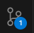

## Challenge-06: A new workspace in a single bound!

### Scenario

* Building on what we learned, we can further combine:
  
  * git committed code
  * environment customization in a .vscode folder or .code-workspace file
  * project tooling and resource configuration via devfile.yaml

* We can deliver all this in a single URL that will automatically provision a new workspace using this content

### Set Up + verification

The benefit of this is that there is no setup.  The format for the "magic" URL is as below:

```http
https://<dev_spaces_fqdn>#https://<git_host>/<user_or_org>/<repo>
```

The git portion of the above URL will retreive the default branch.  If you wish to specify a specific branch you would add: `/tree/<branch_name>`.

Similarly for a pull request branch you would add: `/pull/<pull_request_id>`.

#### Using this information:

* Determine the fully qualified domain name for your Dev Spaces environment

* Use the Dev Spaces fqdn to create a URL string that will load the workspace from:
  
  ```http
  https://github.com/ocp-devspaces-gamification/ds-bonus-cpp.git
  ```

* Test your URL in a new browser tab.  You will see a new workspace instantiated from scratch implementing the preferences configured in the git repository

### Success Criteria

* A new workspace is created for C++ development.

* The workspace is populated with the C++ code from the git repository.

* The workspace has the following extensions installed
  
  * Eclipse CDT (C/C++ Development Tooling)
  * clangd language server

* Build and execute the C++ program
  
  * open a terminal session  (short-cut keys: `<ctrl><shift><``>`)
  
  * execute the `make` command
    
        expected output: `g++ -g hello.cpp -o hello.out`
  
  * execute the compiled program with `./hello.out`
    
        expected output: `Hello, World!`

*  on the left hand side panel, you should see a notification on the source control icon. This indicates the local files have changed relative to the git repository.  

### Resources

* [User guide | Red Hat Product Documentation](https://docs.redhat.com/en/documentation/red_hat_openshift_dev_spaces/3.16/html-single/user_guide/index#starting-a-workspace-from-a-git-repository-url)

---


                                                                                                                                                [Back](../README.md)
