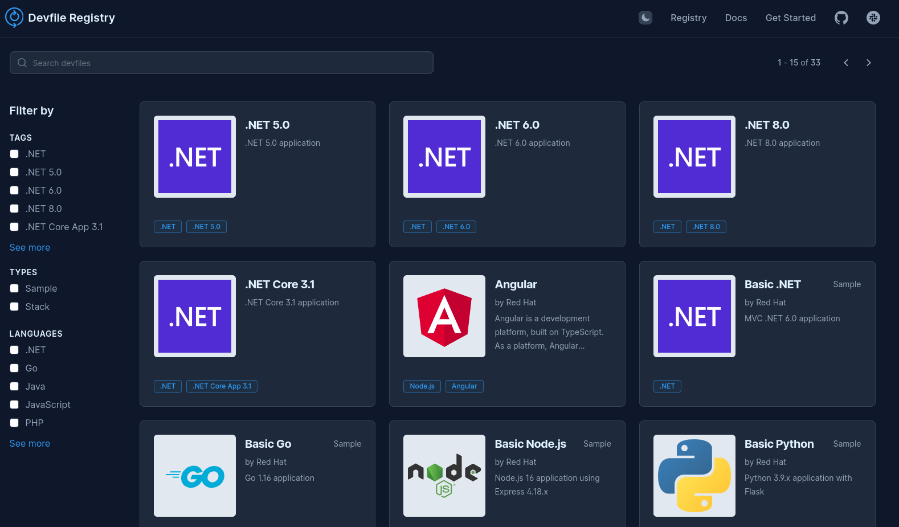
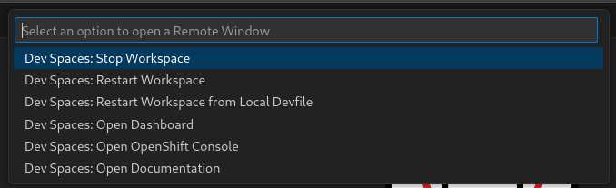
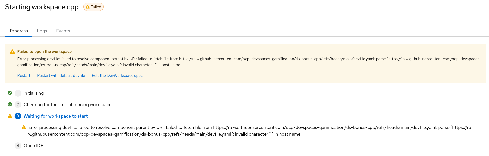

## Challenge-07: Devfile Inheritance

### Scenario

As the number of projects increases, curation of individual devfiles can become a more taxing task.  To help combat this, we can make use of inheritance in devfiles.  In doing so, actual project devfiles become much simpler.  They are used to articulate only the differences from the parent devfile instead of defining the whole workspace.

The parent devfile can be hosted internally or you can leverage the [Devfile Registry](https://registry.devfile.io/viewer)



### Set Up + verification

The main ways to refer to a parent devfile is by id or uri.  The id reference method is used to specify a devfile from a registry

```yaml
schemaversion: 2.2.0
metadata:  
  name: my-project-dev
parent:  
  id: nodejs  
  registryUrl: https://registry.devfile.io/  
  version: 2.0.0
```

The uri method is used when the parent devfile is hosted on a HTTP server.

```yaml
schemaversion: 2.2.0
metadata:  
  name: my-project-dev
parent:  
  uri: https://raw.githubusercontent.com/devfile/registry/main/stacks/nodejs/devfile.yaml
```

After referencing a parent devfile, you may customize your devfile by overriding configuration from the parent devfile or adding new config elements.

```yaml
schemaVersion: 2.0.0
metadata:
  name: with-parent
parent:
  uri: https://raw.githubusercontent.com/che-incubator/devworkspace-api/proposal-25-variant-1-define-stacks/devfile-support/samples/nodejs-stack.devfile.yaml
  projects:
    - name: example
      git:
        checkoutFrom:
          revision: 'mybranch'
commands:

- id: sayhello
  exec:
    label: Say Hello
    commandLine: echo "hello"
    component: nodejs
```

#### Using this information:

* To start delete the last workspace, and recreate it using the single URL method as before 
* In another browser tab navigate to the git URL we used for the workspace

```http
https://git.delta.com/dx/devspaces/ocp-devspaces-gamification/ds-bonus-cpp
```

* Navigate to `devfile.yaml` and get the raw content URL

* Switching back to the Dev Spaces Workspace, open the `devfile.yaml` file

* Delete everything in the file except:
  
  ```yaml
  schemaVersion: 2.2.2
  metadata:
    name: cpp
  ```

* Let's change the name to something different and add a version tag
  
  ```yaml
  schemaVersion: 2.2.2
  metadata:
    name: my_cpp
    version: 1.0.0
  ```

* Add a parent reference to the unmodified copy in the git repository
  
  *(Hint: use the raw content URL you noted earlier)*

* Add some new commands (refer to parent devfile for reference):
  
  * Add a say hello command 
  
  * Add a build clean command

* Reload the workspace from the local devfile:
  
  * Click in the bottom-left corner of the workspace
  
  * This will produce a menu with the option to reload from local devfile
    
    
    
    Note that if there is an issue with your devfile then the workspace will fail to restart.  If that happens, on the workspaces view you can select to start with default devfile
    
    

### Success Criteria

- Workspace restarts successfully
- All commands from local and parent devfile are resolved as tasks
- All tasks are executable 

### Resources

* [Referring to a parent devfile - devfile.io](https://devfile.io/docs/2.3.0/referring-to-a-parent-devfile)

---

[Home](../README.md)
